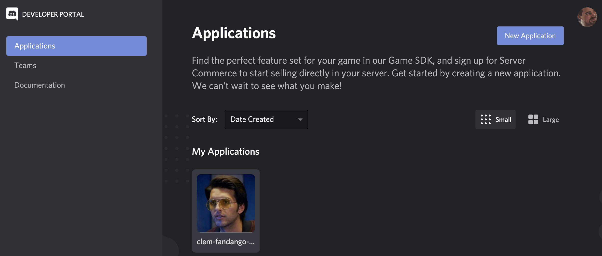

# Clem Fandango Bot

[](https://badge.fury.io/js/clem-fandango-bot)

ClemBot is the health check for your Discord bot connection, that you never knew you needed. Much like Alexander Graham Bell's pioneering message to Watson, ClemBot will send a message to a random member (read: victim) in your configured Discord channel if the handshake with Discord's API was successful.


## Installation

To install ClemBot, simply use your preferred node package management library to pull the binary from the npm registry.

With npm:
```node
npm install -g clem-fandango-bot
```

or, with yarn:
```node
yarn install -g clem-fandango-bot
```

## Setup

To utilize ClemBot with your Discord server, hop in to the [Discord Developer Portal](https://discordapp.com/developers/applications/) and create a new application.



Next, generate a secret in the bot tab for your application, and grant your bot (at a minimum) _Send Message_ and _Read Message History_ permissions. Usage of ClemBot will require this bot token. Keep it secret, keep it safe!


## Usage

```bash
$ clembot                                                                               
Token (-t) required to authenticate clembot.
usage: clembot [-t=<token>]
-t     token for authentication
```

```bash
$ clembot -t {token-redacted}  
  ,--,  ,-.    ,---.            ,---.    .---.  _______ 
.' .')  | |    | .-'  |\    /|  | .-.\  / .-. )|__   __|
|  |(_) | |    | `-.  |(\  / |  | |-' \ | | |(_) )| |   
\  \    | |    | .-'  (_)\/  |  | |--. \| | | | (_) |   
 \  `-. | `--. |  `--.| \  / |  | |`-' /\ `-' /   | |   
  \____\|( __.'/( __.'| |\/| |  /( `--'  )---'    `-'   
        (_)   (__)    '-'  '-' (__)     (_)             
```

You will see logging from ClemBot whenever a member is notified.

`[Sun Oct 27 2019 23:30:57 GMT-0500 (Central Daylight Time)] Notifying Clyde in general`

## Future Development

The bot is fairly simple for now. I intend to allow future customization of the bot with additional flags for specifying notification frequency, which message to notify, etc. Pull Requests and Issues are welcome if you would like to assist with development!
